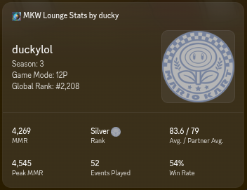

# Mario Kart World Lounge Stats Discord Widget
Display your Mario Kart World Lounge stats in a pretty Discord profile widget.

> [!CAUTION]
> This widget is subject to change, or stop working entirely, based on Discord's rollout of the custom widget feature.


---
## Get Started


> [!IMPORTANT]
> Due to Discord limitations, there is no current way to update the widget of another user. This means in order to use this widget, it is required to create and configure a Discord developer application with widget enabled yourself. While I understand this is not feasible for most non-technical users, unfortunately that is the nature of unreleased features.
> 
> - [A guide to do this can be found here](https://chloecinders.com/blog/discord-widgets)

The following JSON snippet will be used throughout setup:
```json
{
  "data": {
    "dynamic": [
      {
        "type": 1,
        "name": "name",
        "value": "Setup"
      },
      {
        "type": 2,
        "name": "season",
        "value": 3
      },
      {
        "type": 3,
        "name": "rankicon",
        "value": {
          "url": "https://files.ducky.wiki/share/public_assets/external/lounge_ranks/iron.png"
        }
      },
      {
        "type": 1,
        "name": "mmr",
        "value": "0000"
      },
      {
        "type": 1,
        "name": "rank",
        "value": "None"
      },
      {
        "type": 1,
        "name": "averages",
        "value": "00.0 / 00.0"
      },
      {
        "type": 2,
        "name": "events",
        "value": 0
      },
      {
        "type": 1,
        "name": "peakmmr",
        "value": "0000"
      },
      {
        "type": 1,
        "name": "winrate",
        "value": "0%"
      },
      {
        "type": 1,
        "name": "gamemode",
        "value": "0P"
      },
      {
        "type": 1,
        "name": "globalrank",
        "value": "#0"
      }
    ]
  }
}
```
## Update `.env` (Required)*
> 1. Copy `.env.example` to `.env` and fill in each field.

## Update Widget One Time (no live updates)
> 1. Copy the above JSON snippet
> 2. Follow [this guide](https://chloecinders.com/blog/discord-widgets) to create your widget and enter the configuration screen.
> 3. Once in the config, press the 3 dots in the top right and choose `Paste config from clipboard` 
> 4. Choose `Save`, then `Publish` 
> 5. Clone this repository and enter the directory
> 6. Run `npm install` to install the NPM dependencies
> 7. Run `npm run sync` to push real Lounge data to the widget 

## Live Widget Updates
> [!IMPORTANT]
> This requires a way to run the script 24/7, which could be done by running it on startup, or hosting it on a server.

> 1. Copy the above JSON snippet
> 2. Follow [this guide](https://chloecinders.com/blog/discord-widgets) to create your widget and enter the configuration screen.
> 3. Once in the config, press the 3 dots in the top right and choose `Paste config from clipboard` 
> 4. Choose `Save`, then `Publish` 
> 5. Clone this repository and enter the directory
> 6. Run `npm install` to install the NPM dependencies
> 7. Run `npm run track` to start sending real Lounge data to the widget on a 180-second interval 
---

#### Made by @duckyyylol
[](https://ducky.wiki/travel/github) [](https://ducky.wiki/travel/discord) [](https://ducky.wiki) [](https://ko-fi.com/Q1I122WYHF)

*This project is open-source. You can do whatever you want with it. Discord custom widgets, however, are unreleased and subject to change. Please be respectful when making API requests.*
